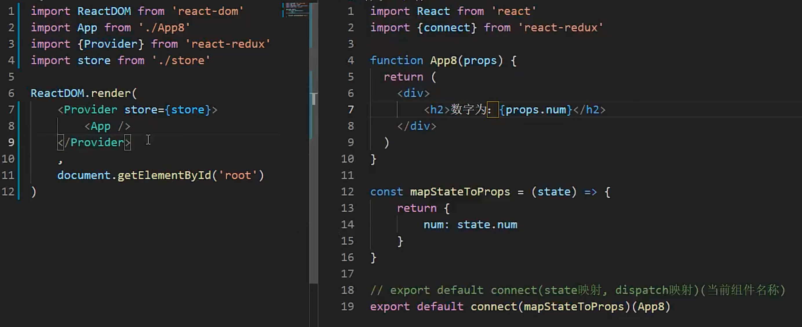

### 1
组件名称必须大写
() 代表其中想要写 html
html 中 {} 代表想要写 js

### 2
this.state
state = { }
constructor() {
state: { }
}

### 3

this.addNum.bind(this)
() => this.addNum()

### 4

函数式组件是没有生命周期
函数式组件没有 this
函数式组件没有 state 状态

```js
import { useState } from "react";
function App() {
  const [msg, setMsg] = useState("hello world");
  return (
    <>
      <h2>{msg}</h2>
      <button onClick={() => setMsg("hello wei")}>修改 msg</button>
    </>
  );
}
```

### 5

数据请求 检测数据更新 垃圾回收

```js
useEffect(() => {
  console.log("num1 更新了");
}, [num1]);
useEffect(() => {
  return () => {
    console.log("销毁阶段");
  };
});
```

### 传参

props 父传子
setNum 子传父

### 上下文空间

```js
import { createContext } from 'react';
const NumContext = createContext();
<NumContext.Provider value={{num, setNum}}>组件</NumContext.Provider>
<NumContext.Consumer>
({num, setNum} => {})
</NumContext.Consumer>
```

### useContext

```js
<NumContext.Consumer>
  ({(num, setNum)} => {})
</NumContext.Consumer>;

import { useContext } from "react";
const { num, setNum } = useContext(NumContext);
```

### 受控组件

```js
import react, { useState } from "react";
export default function App6() {
  const [value, setValue] = useState("asd");
  return (
    <div>
      <input
        type="text"
        value={value}
        onChange={(e) => setValue(e.targe.value)}
      />
      <button>获取input的值</button>
    </div>
  );
}
```

### 不受控组件

useRef

```js
const element = useRef(null)
<div ref={element} />
```

### memo useCallback

缓存 Child

```js
import React, { useState, memo, useCallback } from "react";
const Child = memo((props) => {
  return <button onClick={() => props.doSth()}>累加</button>;
});
export default function App7() {
  const [num, setNum] = useState(1);
  const doSth = useCallback(() => setNum((num) => num + 1), []);
  return (
    <div>
      <h3>{num}</h3>
      <Child doSth={doSth} />
    </div>
  );
}
```

### redux

<!--  -->
<!--  -->
<!--  -->

### 路由

yarn add react-router-dom@6

```js
import App from './App'
import Home from './Home'
import Detail from './Detail'
import Error from './Error'
import {BrowserRouter, Routes, Route} from 'react-router-dom';
const baseRouter = () => (
  <BrowserRouter>
    <Routes>
      <Route path="/" element={<App />}>
        <Route path="/home" element={<Home />}></Route>
        <Route path="/detail/:id" element={<Detail />}></Route>
      </Route>
      <Route path="*" element={<Error />}></Route>
    </Routes>
  </BrowserRouter>
)
export default baseRouter;
JetBrains Mono
Office Code Pro D
Cousine Nerd Font Mono
Hack
iMWritingDuoS NF
// index
import Router from './router/index'
ReactDom.render(
  <Router />,
  document.getElementById('root')
)

// App.jsx
import { Outlet, Link, useLocation, useNavigate } from 'react-router-dom';
export default function App9() {
  const location = useLocation();
  console.log(location.pathname)
  const navigate = useNavigate();
  const goDetail = () => navigate('./detail', {
    state: {
      usename: '张三'
    }
  })
  return (
    <h3>App</h3>
    <Link to="/home">首页</Link>
    <Outlet />
    <button onClick={goDetail}>跳到详情页</button>
  )
}

// detail
import React from 'react';
import { useParams, useSearchParams } from 'react-router-dom';

export default function Detail() {
  const params = useParams()
  return (
    <div>test</div>
  )
}
```

### 404
Fragment PureComponent


### lazy Suspense
```js
const Child = React.lazy(()=>import('./Child'))
export default class Father extends Component {
  render() {
    return (
      <div>
        <Suspense fallback={<h2>loading...</h2>}>
          <Child />
        </Suspense>
      </div>
    )
  }
}
```

